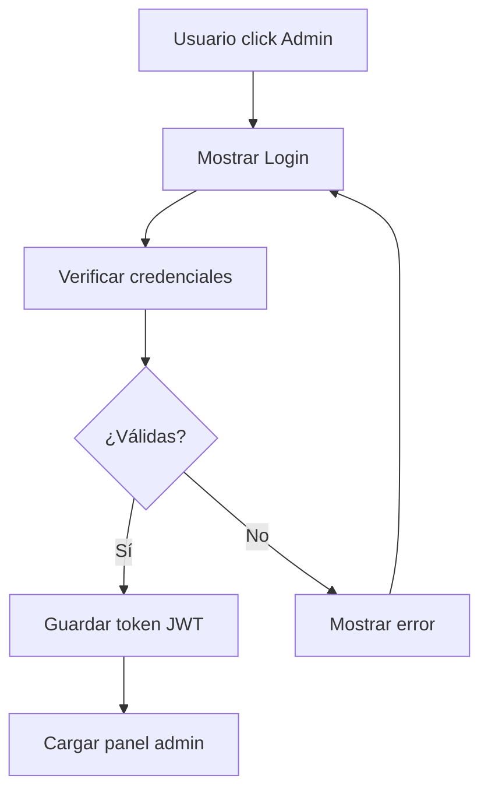

# 🔐 Panel de Administración - MiAbogada

El sistema ahora incluye un panel de administración completo integrado con el backend para gestionar citas y contactos.

## 🚀 Acceso al Panel

### **1. Desde la Landing Page**
1. Ve a http://localhost:3000
2. En el header, click en el botón **"Admin"** (icono de escudo)
3. Serás redirigido al login de administración

### **2. Acceso Directo**
- URL directa: http://localhost:3000/admin (próximamente)
- Por ahora: Click en el botón "Admin" del header

## 🔑 Credenciales de Acceso

| Campo | Valor |
|-------|-------|
| **Email** | `admin@miabogada.com` |
| **Contraseña** | `admin123` |

> ⚠️ **Importante**: Cambiar estas credenciales en producción

## 🎨 Funcionalidades del Panel

### **Dashboard Principal**
- ✅ **Estadísticas en tiempo real**
  - Total de citas
  - Citas pendientes
  - Total de contactos  
  - Contactos pendientes
- ✅ **Estado del sistema**
- ✅ **Notificaciones** (badge con pendientes)

### **Navegación**
- 📊 **Dashboard**: Vista general y estadísticas
- 📅 **Citas**: Gestión de citas (próximamente)
- 📞 **Contactos**: Gestión de mensajes (próximamente)
- ⚙️ **Configuración**: Ajustes del sistema (próximamente)

### **Características Técnicas**
- ✅ **Autenticación JWT** segura
- ✅ **Persistencia de sesión** (localStorage)
- ✅ **Rutas protegidas**
- ✅ **Responsive design**
- ✅ **Sidebar colapsable**
- ✅ **Auto-logout** en token inválido

## 🔄 Flujo de Autenticación



### **Proceso Técnico:**
1. **Usuario ingresa credenciales**
2. **Frontend envía POST** a `/api/auth/login`
3. **Backend valida** usuario y contraseña
4. **Backend responde** con JWT token y datos usuario
5. **Frontend guarda** token en localStorage
6. **Frontend redirige** al panel admin
7. **Requests autenticados** incluyen `Authorization: Bearer TOKEN`

## 🛠️ Componentes Implementados

### **AuthContext.jsx**
```javascript
// Gestión global del estado de autenticación
const { user, token, login, logout, isAuthenticated, apiRequest } = useAuth();
```

**Funciones disponibles:**
- `login(email, password)` - Autenticar usuario
- `logout()` - Cerrar sesión
- `isAuthenticated()` - Verificar si está logueado
- `isAdmin()` - Verificar permisos admin
- `apiRequest(endpoint, options)` - Requests autenticados

### **AdminLogin.jsx**
- ✅ Formulario de login responsivo
- ✅ Validación en tiempo real
- ✅ Mostrar/ocultar contraseña
- ✅ Estados de carga
- ✅ Manejo de errores

### **AdminPanel.jsx**
- ✅ Sidebar con navegación
- ✅ Dashboard con estadísticas
- ✅ Header con notificaciones
- ✅ Layout responsivo
- ✅ Botón de logout

### **ProtectedRoute.jsx**
- ✅ Protección de rutas
- ✅ Redirección automática
- ✅ Verificación de permisos
- ✅ Loading states

## 📱 Responsive Design

### **Desktop (>1024px)**
- Sidebar fijo visible
- Navegación completa
- Dashboard con grid de 4 columnas

### **Tablet (768px - 1024px)**
- Sidebar colapsable
- Grid de 2 columnas
- Navegación optimizada

### **Mobile (<768px)**
- Sidebar overlay
- Grid de 1 columna
- Touch-friendly buttons

## 🔒 Seguridad Implementada

### **Frontend**
- ✅ **JWT token** almacenado de forma segura
- ✅ **Auto-logout** en token expirado
- ✅ **Validación** de permisos en componentes
- ✅ **Sanitización** de inputs

### **Backend Integration**
- ✅ **Verificación JWT** en cada request
- ✅ **Middleware de autenticación**
- ✅ **Roles de usuario** (ADMIN/CLIENT)
- ✅ **Endpoints protegidos**

## 🧪 Testing del Sistema

### **Probar Login:**
```bash
# 1. Abrir frontend
open http://localhost:3000

# 2. Click en botón "Admin"
# 3. Usar credenciales:
#    Email: admin@miabogada.com
#    Password: admin123

# 4. Verificar acceso al dashboard
```

### **Probar API desde Panel:**
El panel automáticamente carga:
- Estadísticas de citas
- Estadísticas de contactos
- Estado del sistema

### **Probar Logout:**
- Click en "Cerrar Sesión" en sidebar
- Verificar redirección a login
- Verificar que token se elimina

## 🚀 Próximas Funcionalidades

### **Gestión de Citas**
- [ ] Lista de todas las citas
- [ ] Filtros por estado y fecha
- [ ] Cambiar estado de citas
- [ ] Ver detalles completos
- [ ] Búsqueda por cliente

### **Gestión de Contactos**
- [ ] Lista de mensajes de contacto
- [ ] Marcar como leído/respondido
- [ ] Búsqueda y filtros
- [ ] Respuesta directa

### **Configuración**
- [ ] Cambiar contraseña admin
- [ ] Configurar horarios disponibles
- [ ] Gestionar tipos de consulta
- [ ] Configuración de emails

### **Reportes**
- [ ] Estadísticas avanzadas
- [ ] Gráficos de citas por mes
- [ ] Exportar datos a CSV
- [ ] Dashboard analytics

## 🛠️ Desarrollo

### **Agregar nueva funcionalidad:**
```javascript
// 1. Crear componente
const NuevaFuncionalidad = () => {
  const { apiRequest } = useAuth();
  
  const loadData = async () => {
    const result = await apiRequest('/api/nueva-endpoint');
    if (result.success) {
      // Manejar datos
    }
  };
};

// 2. Agregar al panel
<AdminPanel>
  <NuevaFuncionalidad />
</AdminPanel>
```

### **Variables de entorno:**
```env
# Frontend (.env)
VITE_API_URL=http://localhost:3001
```

## 📊 Estado Actual

✅ **Completado:**
- Sistema de autenticación
- Dashboard básico
- Integración con APIs
- Design responsive
- Seguridad JWT

🚧 **En desarrollo:**
- Gestión de citas
- Gestión de contactos
- Configuraciones avanzadas

---

¡El panel de administración está **completamente funcional** y listo para gestionar tu práctica legal! 🎉